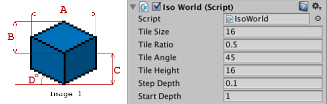
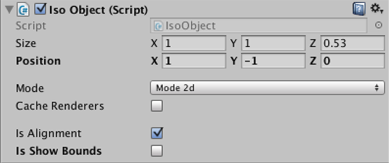

## IsoWorld



```csharp
float tileSize   { get; set; } // (0.00; ----) "A" (Image 1)
float tileRatio  { get; set; } // (0.25; 1.00) "A" * tileRatio = "B"
float tileAngle  { get; set; } // (0.00; 90.0) "D"
float tileHeight { get; set; } // (0.00; ----) "C"
```

```csharp
float startDepth { get; set; } // start value for depth sorting
float stepDepth  { get; set; } // step depth sorting for every object
```

```csharp
static int AllWorldCount { get; }    // Number of IsoWorld
static IsoWorld GetWorld(int index); // Get active IsoWorld by index
```

```csharp
// Convert 3D isometric coordinates to 2D screen coordinates
// iso      - isometric coordinates
// [return] - converted screen coordinates
Vector2 IsoToScreen(Vector3 iso);

// Convert 2D screen coordinates to 3D isometric coordinates
// pos      - screen coordinates
// iso_z    - specific isometric Z
// [return] - converted isometric coordinates
Vector3 ScreenToIso(Vector2 pos, float iso_z = 0.0f);
```

```csharp
// Convert touch position to isometric coordinates for main camera
// finger_id - finger id
// iso_z     - specific isometric Z
Vector3 TouchIsoPosition(int finger_id, float iso_z = 0.0f);

// Convert touch position to isometric coordinates for specific camera
// finger_id - finger id
// camera    - specific camera
// iso_z     - specific isometric Z
Vector3 TouchIsoPosition(int finger_id, Camera camera, float iso_z = 0.0f);
```

```csharp
// Convert touch position to isometric coordinates of tile for main camera
// finger_id - finger id
// iso_z     - specific isometric Z
Vector3 TouchIsoTilePosition(int finger_id, float iso_z = 0.0f);

// Convert touch position to isometric coordinates of tile for specific camera
// finger_id - finger id
// camera    - specific camera
// iso_z     - specific isometric Z
Vector3 TouchIsoTilePosition(int finger_id, Camera camera, float iso_z = 0.0f);
```

```csharp
// Convert mouse position to isometric coordinates for main camera
// iso_z - specific isometric Z
Vector3 MouseIsoPosition(float iso_z = 0.0f)

// Convert mouse position to isometric coordinates for specific camera
// camera - specific camera
// iso_z  - specific isometric Z
Vector3 MouseIsoPosition(Camera camera, float iso_z = 0.0f)
```

```csharp
// Convert mouse position to isometric coordinates of tile for main camera
// iso_z - specific isometric Z
Vector3 MouseIsoTilePosition(float iso_z = 0.0f);

// Convert mouse position to isometric coordinates of tile for specific camera
// camera - specific camera
// iso_z  - specific isometric Z
Vector3 MouseIsoTilePosition(Camera camera, float iso_z = 0.0f);
```

## IsoObject



```csharp
public enum Mode {
	Mode2d, // sorting mode for sprites
	Mode3d  // sorting mode for 3d models
}

// Sorting mode
Mode mode { get; set; }
```

```csharp
// If enable, you should call "UpdateCachedRenderers"
// when you change children hierarchy for this "IsoObject"
bool cacheRenderers { get; set; }
```

```csharp
bool isAlignment  { get; set; } // aligment by tiles in editor
bool isShowBounds { get; set; } // show object bounds in editor
```

```csharp
Vector3 size   { get; set; } // Isometric size of object
float   sizeX  { get; set; } // Isometric size of object by X
float   sizeY  { get; set; } // Isometric size of object by Y
float   sizeZ  { get; set; } // Isometric size of object by Z
Vector2 sizeXY { get; set; } // Isometric size of object by XY plane
Vector2 sizeYZ { get; set; } // Isometric size of object by YZ plane
Vector2 sizeXZ { get; set; } // Isometric size of object by XZ plane
```

```csharp
Vector3 position   { get; set; } // Isometric position of object
float   positionX  { get; set; } // Isometric position of object by X
float   positionY  { get; set; } // Isometric position of object by Y
float   positionZ  { get; set; } // Isometric position of object by Z
Vector2 positionXY { get; set; } // Isometric position of object by XY plane
Vector2 positionYZ { get; set; } // Isometric position of object by YZ plane
Vector2 positionXZ { get; set; } // Isometric position of object by XZ plane
```

```csharp
Vector3 tilePosition   { get; set; } // Isometric position of object tile
float   tilePositionX  { get; set; } // Isometric position of object tile by X
float   tilePositionY  { get; set; } // Isometric position of object tile by Y
float   tilePositionZ  { get; set; } // Isometric position of object tile by Z
Vector2 tilePositionXY { get; set; } // Isometric position of object tile by XY plane
Vector2 tilePositionYZ { get; set; } // Isometric position of object tile by YZ plane
Vector2 tilePositionXZ { get; set; } // Isometric position of object tile by XZ plane
```

```csharp
// Return Ray from virtual isometric camera to isometric point
Ray RayFromIsoCameraToIsoPoint(Vector3 iso_pnt);
```

## IsoPhysics

```csharp
bool Raycast(...)
int  RaycastNonAlloc(...)
...
```
Copy of Unity raycast functions ([Physics.Raycast](http://docs.unity3d.com/ScriptReference/Physics.Raycast.html), [Physics.RaycastNonAlloc](http://docs.unity3d.com/ScriptReference/Physics.RaycastNonAlloc.html), [Physics.BoxCast](https://docs.unity3d.com/ScriptReference/Physics.BoxCast.html) etc.) for isometric world.

## Physics events

```csharp
void OnIsoTriggerEnter   (IsoCollider  iso_collider);
void OnIsoTriggerExit    (IsoCollider  iso_collider);
void OnIsoCollisionEnter (IsoCollision iso_collision);
void OnIsoCollisionExit  (IsoCollision iso_collision);
```
Copy of Unity physics events ([OnTriggerEnter](http://docs.unity3d.com/ScriptReference/MonoBehaviour.OnTriggerEnter.html), [OnTriggerExit](http://docs.unity3d.com/ScriptReference/MonoBehaviour.OnTriggerExit.html), [OnCollisionEnter](http://docs.unity3d.com/ScriptReference/MonoBehaviour.OnCollisionEnter.html), [OnCollisionExit](http://docs.unity3d.com/ScriptReference/MonoBehaviour.OnCollisionExit.html)) for isometric world.

> Note! For listen trigger events you should add add IsoTriggerListener for your IsoObject and IsoCollisionListener for listen collision events.

## IsoRigidbody

Copy of [Rigidbody](http://docs.unity3d.com/ScriptReference/Rigidbody.html) for isometric world.

## IsoCollider

Copy of [Collider](http://docs.unity3d.com/ScriptReference/Collider.html) for isometric world.

## IsoBoxCollider

Copy of [BoxCollider](http://docs.unity3d.com/ScriptReference/BoxCollider.html) for isometric world.

## IsoSphereCollider

Copy of [SphereCollider](http://docs.unity3d.com/ScriptReference/SphereCollider.html) for isometric world.

## IsoCapsuleCollider

Copy of [CapsuleCollider](http://docs.unity3d.com/ScriptReference/CapsuleCollider.html) for isometric world.

## IsoCollision

Copy of [Collision](http://docs.unity3d.com/ScriptReference/Collision.html) for isometric world.

## IsoContactPoint

Copy of [ContactPoint](http://docs.unity3d.com/ScriptReference/ContactPoint.html) for isometric world.

## IsoRaycastHit

Copy of [RaycastHit](http://docs.unity3d.com/ScriptReference/RaycastHit.html) for isometric world.
