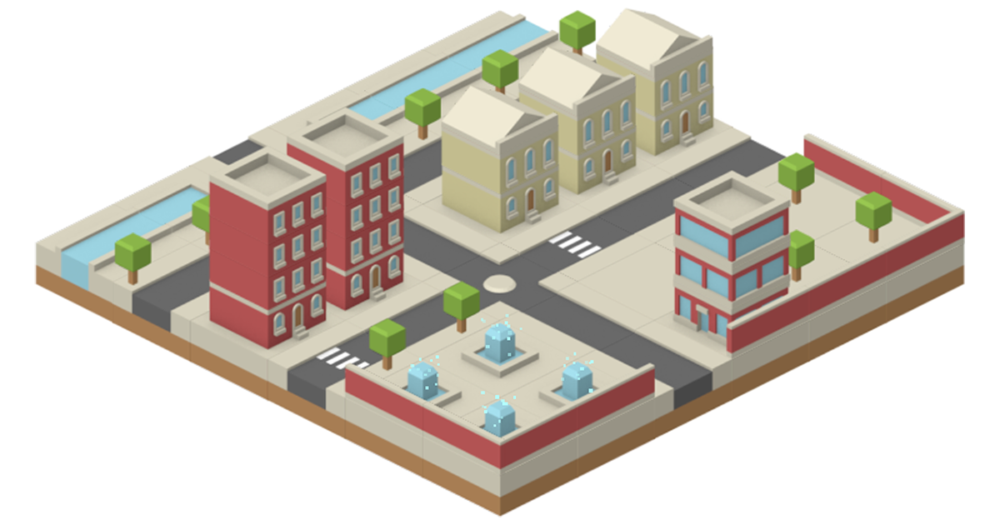

# Isometric 2.5D Toolset

> Make 2.5D isometric game in Unity easy!

[Asset Store](https://assetstore.unity.com/packages/tools/sprite-management/isometric-2-5d-toolset-27851) |
[Forum](https://forum.unity.com/threads/isometric-2-5d-toolset.291418/) |
[Web Demo](https://blackmatov.github.io/unity-assets/isometric-toolset/demo) |
[Usage Video (Sprites)](http://www.youtube.com/watch?v=IwJ_ofKG9_Y) |
[Usage Video (Physics)](http://www.youtube.com/watch?v=wmXhyDHXYcM) |
[API Reference](Assets/IsoTools/Docs/API.md) |
[Changelog](Assets/IsoTools/Docs/CHANGELOG.md)

## Features

- Automatic sorting 2D isometric tiles and objects
- Sorting objects with single-tile size as well as multiple-tiles size
- Auxiliary functions for converting isometric coordinates into screen coordinates and conversely
- Placing and snapping of objects in the Unity editor
- Physics support! (Colliders, Rigidbodies, Trigger and Collision events, Raycasts)
- Helpful mouse and touch functions
- Custom isometric tile angle, ratio and height
- Mix 2D and 3D support
- Full [PlayMaker](https://assetstore.unity.com/packages/tools/visual-scripting/playmaker-368) support

Supports Unity 2017.4 (LTS) and newer, both Personal and Pro. Full C# source code included.

Leave your rating for this Asset. It is very important for me and the development of the project :) Thank you!

## Limitations

- Intersection of isometric objects is not allowed
- Parent-child related isometric objects is not allowed

## Screenshots

### PlayMaker Support

### Custom isometric tile angle, ratio and height

### Mix 2D and 3D support

### Preview samples

## [License (MIT)](./LICENSE.md)

* Samples use (CC0 1.0) sprites from [kenney.nl](http://www.kenney.nl/assets)
* Samples use (CC BY 4.0) sprites from [dragosha.com](http://dragosha.com/free)
* Samples use free models from [Honeti's models](https://assetstore.unity.com/packages/3d/characters/humanoids/fantasy/3-free-characters-18098)
